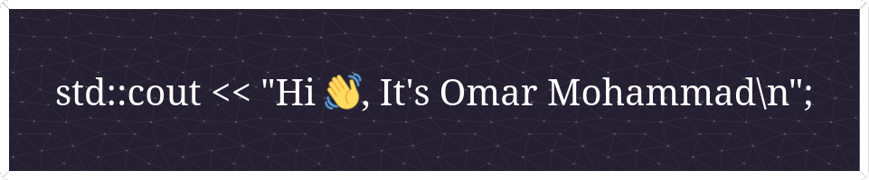

# My Skillset

# What I am learning right now

- Taking courses in [OSSU](https://github.com/omardoescode/OSSU). Currently learning: Maths for computer science and Nand2Tetris courses
- Studying for [ECPC](https://github.com/omardoescode/problem_solving.git).
- Learning more about C++, design patterns, OOP design, building architecture and services.
- Reading books about how to get better at coding, working in teams, producing refactored clean code

# Current Job

- Volunteering at a local charity to give kids an introductory course to programming and specifically the C++ language.
- Intern at CodeAlpha.

# Current Repos I am working on

- [OSSU](https://github.com/omardoescode/OSSU)
- [Problem Solving](https://github.com/omardoescode/OSSU)

# Stats

    &nbsp;&nbsp;
    &nbsp;&nbsp;

